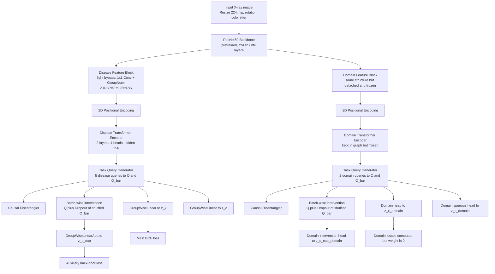

# CheXpert Causal Deconfounding Course Project

这个仓库用于整理课程论文中实际采用的 CheXpert 5 类胸片多标签分类代码。主实现位于 [crocodile_crltga](./crocodile_crltga)，核心思路是把 `CROCODILE` 的因果干预思路与 `CRLTGA` 风格的 query-level 表示建模结合起来，但最终用于主实验的是经过稳定化裁剪后的 `disease-only` 版本。

## 最终采用的版本

- 任务：CheXpert 5 类多标签分类
- 标签：`Atelectasis`、`Cardiomegaly`、`Consolidation`、`Edema`、`Pleural Effusion`
- 最终采用的训练配置：[`crocodile_crltga/configs/chexpert_small_5label_stage2_evalfix_bs24_lr2e5_20e_diseaseonly.json`](./crocodile_crltga/configs/chexpert_small_5label_stage2_evalfix_bs24_lr2e5_20e_diseaseonly.json)
- 最佳单模型验证结果：`macro_auc = 0.8363661866572223`，`tuned_macro_f1 = 0.6446668301182221`
- 说明：`weighted soup` 只作为 checkpoint 融合结果，不作为新的网络结构写入主方法

## 最终采用网络结构



## 结构说明

最终版本保留了双分支框架，但训练目标已经收缩为稳定的 `disease-only` 主线：

- `ResNet50` 作为共享特征提取器，冻结到 `layer4`
- `CrocodileFeatureBlock` 走轻量旁路，不再训练复杂的 `DNet/ACmix/Conv1d` 路径
- domain 分支保留在实现中，但 `detach_domain_feature_map = true`、`freeze_domain_branch = true`
- `lambda_d_main = 0`、`lambda_d_sp = 0`、`lambda_d_bd = 0`
- `lambda_triplet = 0`、`lambda_dag = 0`
- 因此真正驱动训练的主要是疾病主头 `z_x` 和较小权重的干预头 `z_c_cap`

这意味着最终方法可以概括为：**冻结的 ResNet50 + 轻量化 query-based disease branch + 因果干预辅助头**。

## 目录说明

```text
.
├── README.md
├── crocodile_crltga/
│   ├── configs/
│   ├── docs/
│   └── src/
├── evaluate_chexphoto_kamen_baseline.py
├── evaluate_indiana_kamen_baseline.py
├── download_chexphoto_valid.py
└── generate_paper_docx.py
```

核心说明文档：

- [`crocodile_crltga/docs/architecture_overview.md`](./crocodile_crltga/docs/architecture_overview.md)：最终采用架构、模块职责、训练链路
- [`crocodile_crltga/docs/experiment_record.md`](./crocodile_crltga/docs/experiment_record.md)：实验过程、稳定化策略、最终结果与选择依据

## 运行方式

训练：

```bash
cd crocodile_crltga
python -m src.train --config configs/chexpert_small_5label_stage2_evalfix_bs24_lr2e5_20e_diseaseonly.json
```

Grad-CAM / 单图推理：

```bash
cd crocodile_crltga
python -m src.infer_cam \
  --config configs/chexpert_small_5label_stage2_evalfix_bs24_lr2e5_20e_diseaseonly.json \
  --checkpoint outputs/<run_dir>/best_auc.pt \
  --image /absolute/path/to/image.jpg
```
